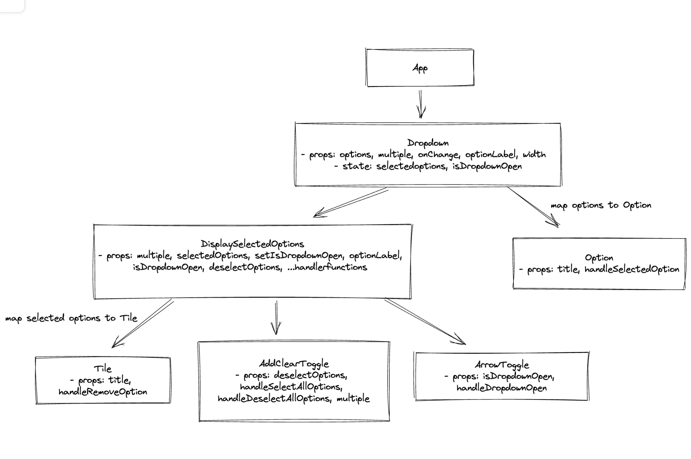

# Dropdown
Dropdown resusable component built from scratch using React.

## Demo
https://user-images.githubusercontent.com/33162355/199136192-2a8c28bc-8077-4ba6-bae9-cd7c8736f7da.mov

## Architecture

    

## Important Script

In the project directory, you can run:

### `npm start`

Runs the app in the development mode.\
Open [http://localhost:3000](http://localhost:3000) to view it in your browser.

